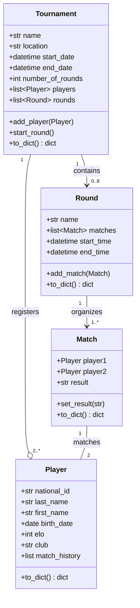

# Chess tournament

**Relation**
- A standard chess tournament has 4 to 8 rounds. If the tournament is deleted, its rounds are also deleted.
- At least 2 players are registered in a tournament. Players exist independently of the tournament. A player can participate in multiple tournaments.
- A Round organizes 1 or more Matches. If the Round is deleted, its Matches are also deleted.
- A Match opposes exactly 2 Players. Players exist independently of the Match.

| symbol | type of relation   | explication                                                                    |
|--------|--------------------|--------------------------------------------------------------------------------|
| -->    | Composition        | Strong link: the "parent" object owns the "child" objects.                     |
| --0    | Aggregation        | Weak link: the "parent" object uses the "child" objects but does not own them. |
| --     | Simple association | Logical link whitout ownership                                                 |
